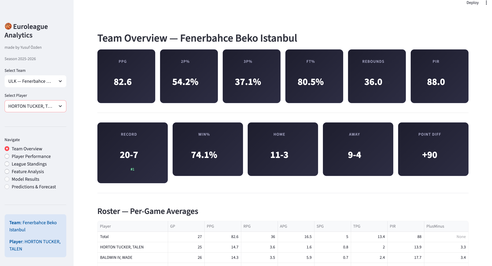
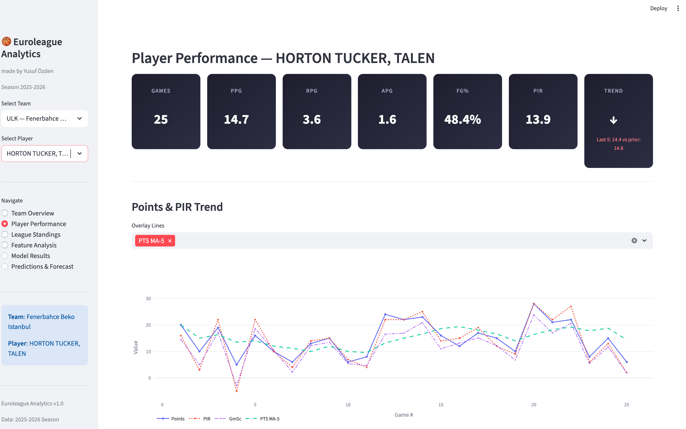
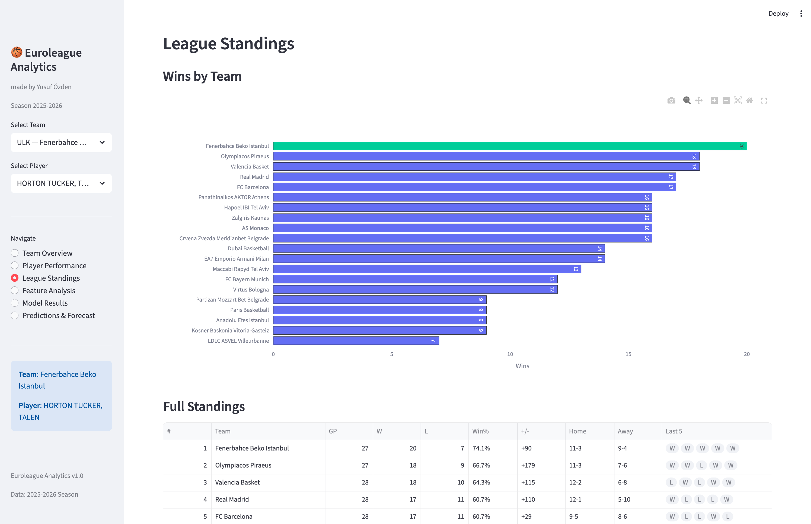
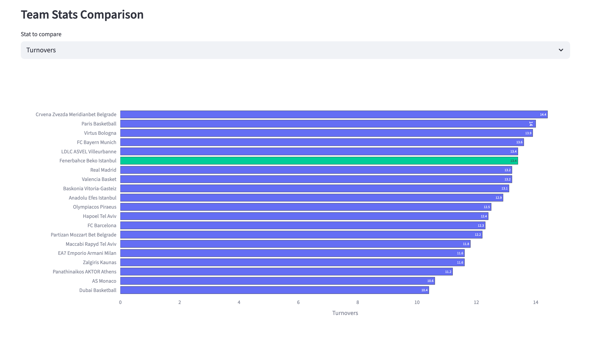
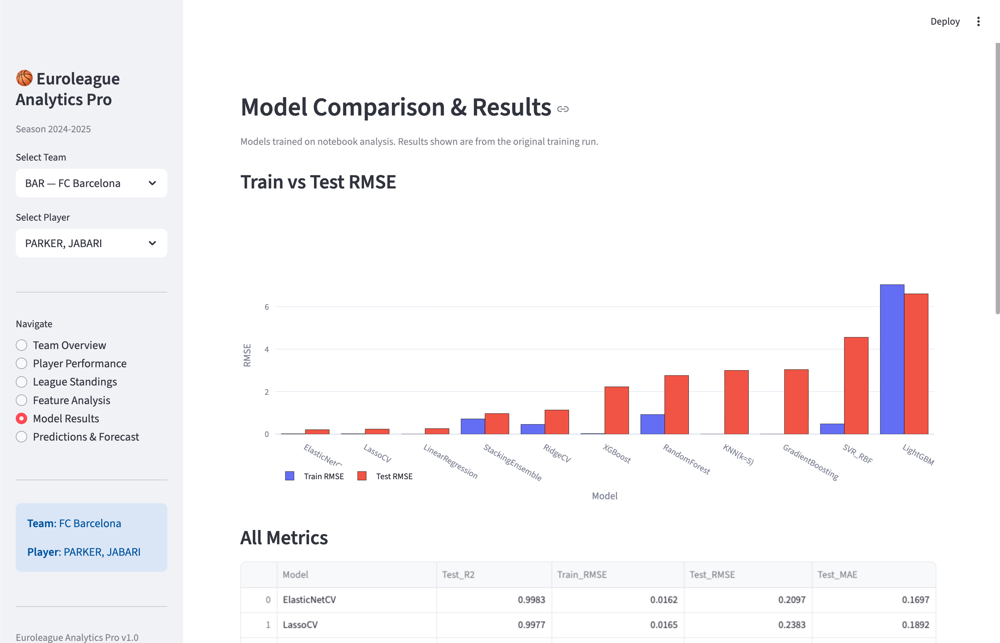
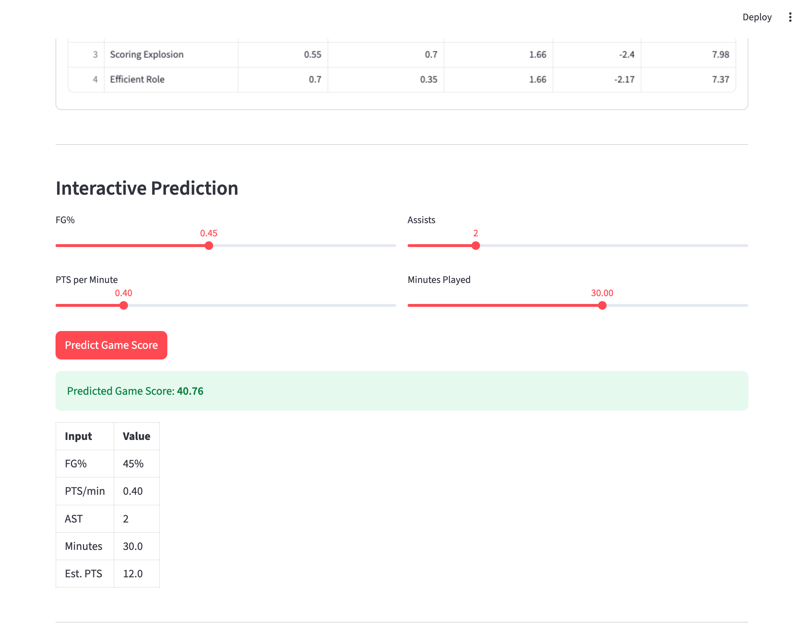
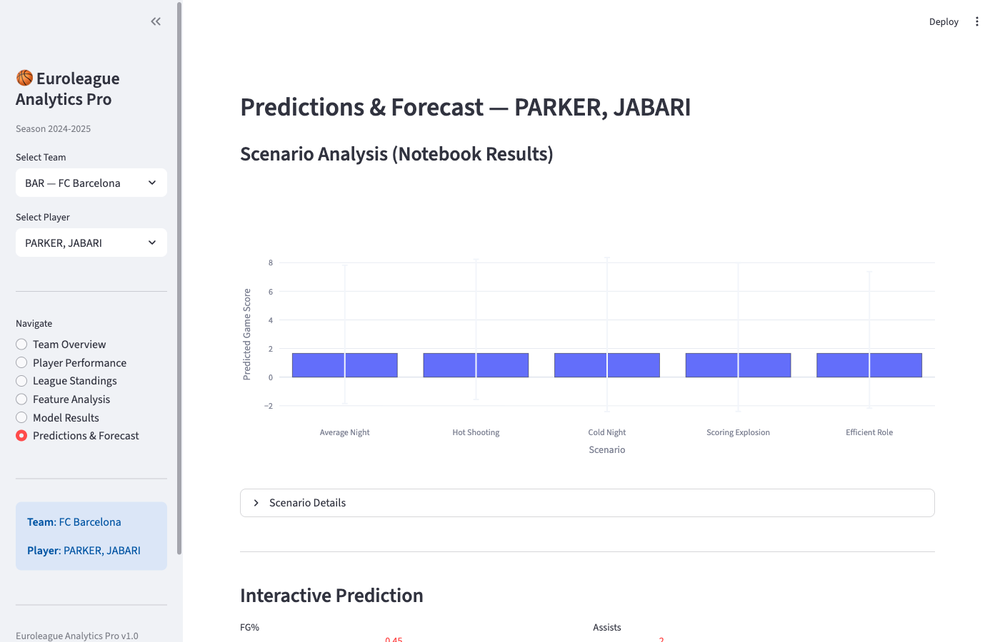

# Euroleague Analytics

End-to-end sports analytics platform with **live Euroleague API integration**, ML models, interactive Streamlit dashboard, and professional data science practices.

## Architecture

```
Euroleague API  ──►  data_pipeline.py  ──►  Feature Engineering  ──►  ML Pipeline  ──►  Dashboard
     │                     │                       │                     │               │
  REST API           Parquet Cache            40+ Features          10+ Models       Streamlit
  Live Data           (6h TTL)              Rolling/EWMA/Lag       TensorFlow       Interactive
  20 Teams                                  TS%/eFG%/GmSc          XGBoost         ARIMA Forecast
  9000+ Games                                                      Stacking        Team/Player
```

## Key Features

| Capability | Implementation |
|-----------|---------------|
| **Interactive Dashboard** | Streamlit app with team/player selectors, 6 pages, Plotly charts |
| **Data Source** | Live Euroleague API — all 20 teams, 9000+ game boxscores |
| **Data Pipeline** | `data_pipeline.py` with Parquet caching, multi-season support |
| **Feature Engineering** | 40+ features: TS%, eFG%, GmSc, rolling stats, EWMA, lag, momentum |
| **ML Models** | Ridge, Lasso, ElasticNet, RF, XGBoost, LightGBM, SVR, KNN, Keras NN, Stacking |
| **Deep Learning** | TensorFlow/Keras with BatchNorm, Dropout, EarlyStopping, LR scheduling |
| **Interpretability** | SHAP (TreeExplainer/KernelExplainer), Partial Dependence Plots |
| **Time Series** | ARIMA forecast per player with confidence intervals |
| **Validation** | Temporal train/test split, TimeSeriesSplit CV (no data leakage) |

## Quick Start

```bash
# 1. Setup
python -m venv venv
source venv/bin/activate
pip install -r requirements.txt

# 2. Launch Dashboard
streamlit run dashboard.py

# 3. Or run the analysis notebook
jupyter notebook euroleague_analytics_pro.ipynb
```

## Dashboard

The interactive dashboard (`dashboard.py`) provides 6 pages:

| Page | Description |
|------|-------------|
| **Team Overview** | Team KPIs, win/loss record, roster averages, points per round, top scorers |
| **Player Performance** | Per-game trends (PTS, PIR, GmSc), FG% chart, distributions, game log |
| **League Standings** | Standings chart, full table, team stat comparison, scoring leaders |
| **Feature Analysis** | Correlation heatmap, mutual information, feature distributions |
| **Model Results** | Train vs Test RMSE, metrics table, actual vs predicted, residuals |
| **Predictions & Forecast** | Scenario analysis, interactive prediction builder, ARIMA forecast |

**How it works**: Select a team from the sidebar, then pick any player from their roster. All charts and analytics update dynamically.

### Screenshots

**Team Overview** — KPIs, win/loss record, roster table, points per round chart



**Player Performance** — Per-game trends with moving averages, FG% chart, distributions



**League Standings** — All 20 teams ranked, team stats comparison across any metric



**Team Stats Comparison** — Compare any stat across all teams with highlighted selection



**Model Results** — Train vs Test RMSE for 10+ models, full metrics table



**Predictions & Forecast** — Interactive sliders for live ML predictions, scenario analysis, ARIMA forecast





### Configuration

The notebook's analysis parameters are in the CONFIG cell:

```python
CONFIG = {
    "season": 2025,            # 2025-26 season
    "player_name": "Hayes",    # Partial name match
}
```

### CLI Data Pipeline

```bash
python data_pipeline.py --season 2025 --action info
python data_pipeline.py --season 2025 --player "Tavares" --action player
python data_pipeline.py --season 2025 --action team
python data_pipeline.py --season 2025 --action standings
```

## Project Structure

```
├── dashboard.py                      # Streamlit interactive dashboard
├── euroleague_analytics_pro.ipynb    # Main analysis notebook
├── data_pipeline.py                  # Data ingestion (Euroleague API + caching)
├── euroleague_data_fetcher.py        # Standalone data fetcher utility
├── build_notebook.py                 # Notebook builder script
├── nhd_euroleague.csv                # Static fallback dataset
├── requirements.txt                  # Dependencies
├── cache/                            # API response cache (auto-generated, gitignored)
└── outputs/                          # Generated outputs
    ├── config.json
    ├── model_comparison.csv
    ├── feature_importance.csv
    ├── scenarios.csv
    ├── player_enhanced.csv
    └── *.png                         # Visualization exports (gitignored)
```

## Data Pipeline (`data_pipeline.py`)

The pipeline module provides:

| Method | Description |
|--------|-------------|
| `get_player_boxscore_season()` | Full season boxscore (all players, game-by-game) |
| `get_player_game_stats(name)` | Single player extraction with fuzzy name matching |
| `get_team_season_stats()` | Team-level stats (traditional/advanced) |
| `get_standings()` | League standings (basic/streaks/margins) |
| `get_shot_data_season()` | Shot-level data for the season |
| `get_player_leaders()` | Stat leaders (scoring, assists, etc.) |
| `get_player_boxscore_multi_season()` | Multi-season historical data |
| `engineer_player_features()` | Automated feature engineering (40+ features) |

Features:
- **Parquet caching** with configurable TTL (avoids redundant API calls)
- **Automatic column detection** (works with any euroleague_api output format)
- **Graceful fallback** to static CSV when API is unavailable

## ML Pipeline

### Models Evaluated (10+)

**Linear**: Linear Regression, Ridge (RidgeCV), Lasso (LassoCV), ElasticNet (ElasticNetCV)

**Tree-based**: Random Forest (GridSearchCV), Gradient Boosting, XGBoost (early stopping), LightGBM

**Other**: SVR (GridSearchCV), KNN (optimal K selection)

**Deep Learning**: Keras NN (64→32→16→1, BatchNorm, Dropout, L2 reg, EarlyStopping, LR decay)

**Ensemble**: StackingRegressor (Ridge + RF + GB + XGBoost → Ridge meta-learner)

### Validation Strategy

- **Temporal split**: Last N games as test set (no shuffling — respects time order)
- **TimeSeriesSplit**: Cross-validation that preserves temporal ordering
- **No data leakage**: All feature engineering done before split

## Euroleague API

Data sourced from [`euroleague_api`](https://github.com/giasemidis/euroleague_api):

```bash
pip install euroleague-api
```

Available endpoints: Player stats, Team stats, Standings, Shot data, Boxscores, Play-by-play, Game metadata.

## Requirements

- Python 3.10+
- Core: pandas, numpy, scikit-learn, scipy, matplotlib, seaborn
- ML: xgboost, lightgbm, tensorflow
- Analysis: shap, statsmodels, plotly
- Data: euroleague-api

See `requirements.txt` for full list.

## References

- [Euroleague API](https://github.com/giasemidis/euroleague_api)
- [Basketball Reference](https://www.basketball-reference.com)
- [Euroleague Official](https://www.euroleaguebasketball.net)
- [Dean Oliver's Four Factors](https://www.basketball-reference.com/about/factors.html)


---

**Author**: Yusuf Ozden
**Last Updated**: 2025
